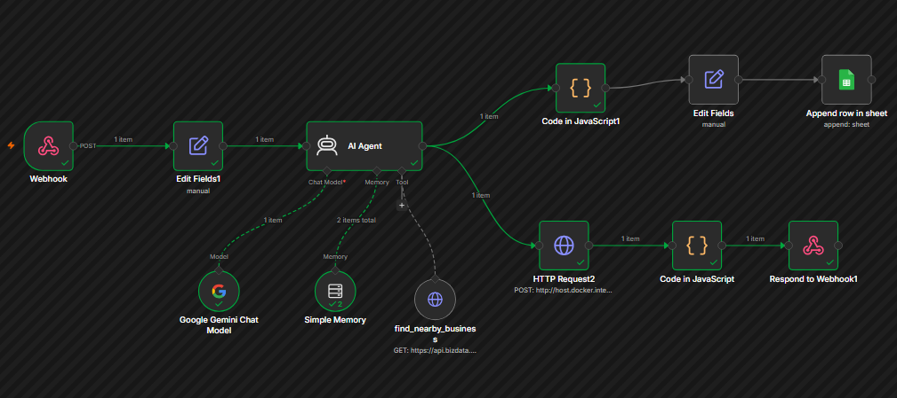

# AI Voice Agent

A voice-and-text AI assistant built with a **React frontend** and an **n8n workflow backend**. Users can type or speak to the assistant, and it replies with both text and spoken audio. It can hold a normal conversation, break a problem down into three possible solutions, and search for nearby businesses using the user's live location.

---

## 🎥 Demo

https://github.com/user-attachments/assets/bd45eee8-52e9-4973-91c0-333605950a62

---

## ✨ Features

- **Text + Voice chat** — talk to the assistant by typing or using the microphone (browser speech recognition)
- **Spoken replies** — every assistant reply is converted to audio by the backend and played back automatically; the frontend never generates speech itself, it only plays what the backend sends
- **3-solutions flow** — describe a problem and the assistant proposes exactly three short, distinct solutions, then lets you pick one to continue with
- **Nearby business search** — ask for a nearby restaurant, plumber, electrician, etc. and the assistant uses your device's location to find real options
- **Conversation memory** — each user's conversation is remembered across messages using a session-based memory buffer
- **Automatic logging** — whenever a business is successfully found, its name and number are logged to a Google Sheet automatically
- **Single API contract** — the entire frontend talks to exactly one backend webhook; all routing/decision logic (chat vs. solutions vs. business search) happens inside the n8n workflow via AI function-calling, not in the frontend

---

## 🏗️ Architecture

```
┌─────────────────┐        POST /assistant/chat        ┌───────────────────────┐
│  React Frontend │ ──────────────────────────────────▶│   n8n Workflow (AI)   │
│  (Vite + React) │                                     │                       │
│                  │◀──────────────────────────────────│  { type, reply, audio}│
└─────────────────┘        { type, reply, audio }       └───────────────────────┘
        │                                                          │
        │  microphone → browser speech-to-text → text only          ├─ AI Agent (Google Gemini)
        │  speaker ◀── plays back base64 audio from backend         ├─ Simple Memory (per-user session)
        │                                                          ├─ find_nearby_business tool → Bizdata API
        └─ never generates its own speech or business logic         ├─ Piper (local TTS) → spoken audio
                                                                     └─ Google Sheets (business log)
```

**Design principle:** the frontend is a thin client. It captures input (typed or spoken-to-text), sends it to a single webhook along with conversation history and the user's location, and renders whatever comes back — including playing audio the backend already generated. All intelligence (deciding what to do with a message, searching for businesses, generating speech) lives in the n8n workflow.

---

## 🖥️ Frontend

**Stack:** React + Vite, Tailwind CSS, Axios, TanStack Query

### Request contract

```json
POST {{N8N_BASE_URL}}{{CHAT_PATH}}

{
  "message": "Find a plumber near me",
  "history": [{ "role": "user", "content": "..." }],
  "userId": "user-123",
  "requestSolutions": false,
  "location": { "latitude": 31.5204, "longitude": 74.3587 }
}
```

### Response contract

```json
{
  "type": "text",
  "reply": "Here's a plumber near you: ...",
  "audio": "base64-encoded-wav-audio"
}
```

### Setup

```bash
cp .env.example .env
# then fill in:
#   VITE_N8N_BASE_URL=https://your-n8n-host/webhook
#   VITE_N8N_CHAT_PATH=/assistant/chat

npm install
npm run dev
```

---

## ⚙️ Backend — n8n Workflow



| Node | Purpose |
|---|---|
| **Webhook** | Single entry point (`POST /assistant/chat`) for every message from the frontend |
| **Edit Fields1** | Normalizes the raw webhook body into flat fields: `Message`, `UserID`, `Latitude`, `Longitude` |
| **AI Agent** | The core reasoning engine — decides whether to chat normally, propose 3 solutions, or call a tool |
| **Google Gemini Chat Model** | The LLM powering the AI Agent |
| **Simple Memory** | Keeps a per-user (`UserID`) rolling conversation history so the assistant has context across messages |
| **find_nearby_business** | A tool the AI Agent can call to search real businesses near the user's coordinates via the Bizdata API |
| **HTTP Request2** | Sends the AI Agent's text reply to a locally-hosted Piper TTS server and gets back spoken audio |
| **Code in JavaScript** | Converts the raw audio binary into base64 and assembles the final `{ type, reply, audio }` response shape |
| **Respond to Webhook1** | Returns the final JSON response to the frontend |
| **Code in JavaScript1** | Extracts business results (if any) from the AI Agent's tool call, for logging |
| **Edit Fields** | Maps the found business's name/number into sheet-ready fields |
| **Append row in sheet** | Logs the business (name, number, date) to a Google Sheet — only runs when a business was actually found |

### Voice pipeline

- **Speech-to-text (input):** handled entirely in the browser (Web Speech API) — the frontend only ever sends transcribed text to the backend, never raw audio
- **Text-to-speech (output):** handled entirely by a self-hosted [Piper](https://github.com/OHF-Voice/piper1-gpl) TTS server — the backend generates the audio and returns it as base64; the frontend just plays it

---

## 🗺️ Roadmap

- [ ] Twilio-based calling (place a real call to a found business) — pending phone number verification
- [ ] Multi-language voice model support (Piper currently runs a single-language voice)
- [ ] Structured business result cards in the UI (currently business results are spoken/described in natural language rather than rendered as clickable cards)

---

## 🛠️ Tech Stack

**Frontend:** React, Vite, Tailwind CSS, Axios, TanStack Query
**Backend:** n8n, Google Gemini, Piper TTS, Bizdata API, Google Sheets, Twilio (planned)
